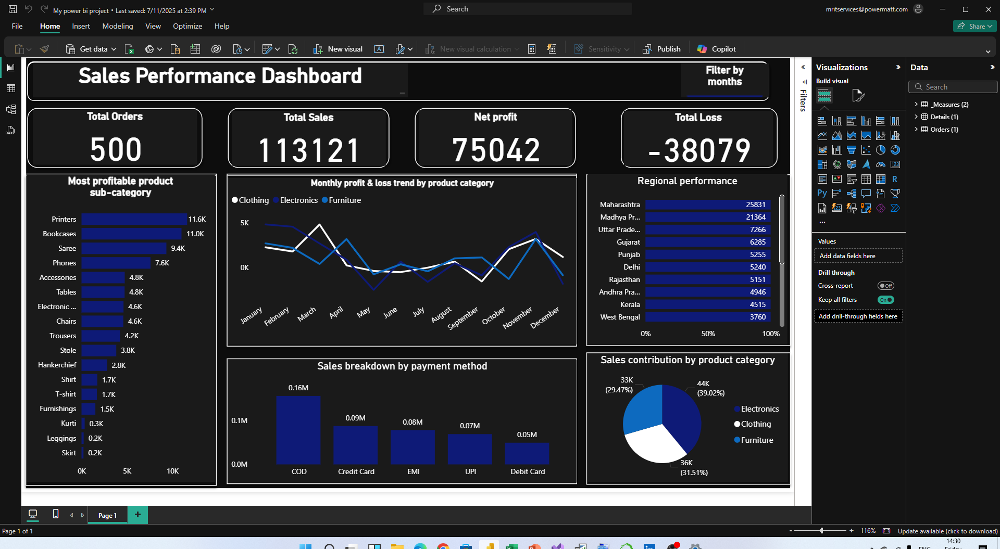

# 📊 Sales Performance Dashboard - Power BI

This repository contains a **Sales Performance Dashboard** built with **Power BI** to provide a comprehensive analysis of business sales data. The dashboard offers critical insights into sales performance, profit and loss trends, regional breakdown, and product category analysis.

## 🚀 Features

- **Total KPIs**: Displays total orders, total sales, net profit, and total loss.
- **Most Profitable Sub-Categories**: Bar chart ranking product sub-categories by profitability.
- **Monthly Trend Analysis**: Line chart showing monthly profit/loss trends by product category (Clothing, Electronics, Furniture).
- **Regional Performance**: Horizontal bar chart comparing sales across states like Maharashtra, Delhi, Gujarat, etc.
- **Sales Breakdown by Payment Method**: Bar chart showing revenue contribution from COD, Credit Card, EMI, UPI, and Debit Card.
- **Sales Contribution by Product Category**: Pie chart visualizing the percentage of total sales from each category.

## 📁 Files Included

- `bi.png`: 📸 Screenshot of the dashboard.
- `sales_dataset.csv` *(or replace with actual filename)*: 📊 Dataset used to build the dashboard.

## 📌 Tools Used

- **Power BI Desktop**
- **DAX for calculations**
- **Power Query for data transformation**
- **Basic measures and calculated fields**

## 🛠️ How to Use

1. Clone or download this repository.
2. View the attached PNG image for dashboard layout inspiration.
3. Open Power BI Desktop.
4. Load the dataset (`sales_dataset.csv` or your preferred file).
5. Rebuild or enhance the dashboard using your data and visuals.

## 📈 Insights Gained

This dashboard can help businesses:

- Identify the most profitable product lines.
- Track monthly sales and losses by product category.
- Understand which regions generate the most revenue.
- Evaluate payment method preferences among customers.

## 🧑‍💻 Author

**GIFT SHAIBU**  
_Data Analyst | Power BI Enthusiast_

## 🌐 Connect with Me

- GitHub: [GIFT-SHAIBU](https://github.com/GIFT-SHAIBU)
- LinkedIn: [www.linkedin.com/in/gift-shaibu]
- Email: shaibugift@gmail.com

---

⭐ Feel free to **star** this repository if you find it useful, and **fork** to contribute or adapt it to your own project needs!
